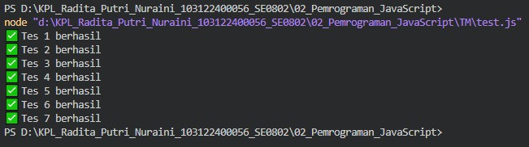

# Tugas Mandiri 02: Pemrograman JavaScript

Penjelasan Program

Program tersebut bertujuan untuk mengubah angka di dalam sebuah array menjadi kata tertentu berdasarkan kelipatan.

Kelipatan 14 atau angka 0 --> "FizzBuzz"
Kelipatan 2 --> "Fizz"
Kelipatan 7 --> "Buzz"
Dan angka lainnya selain kelipatan diatas akan tetap ditampilkan dengan angka asli.

Program akan menolak jika inputnya bukan array dengan menampilkan pesan "input tidak valid"

