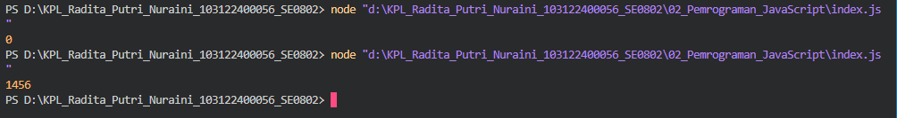

# Tugas Pendahuluan 02: Pemrograman JavaScript
**Soal**

Kamu sudah menulis fungsi mulOfArray. Ujilah dengan input [2, 0, 26, 28, -2], dengan output yang seharusnya adalah 1456. Jika kamu menemukan bahwa hasilnya berbeda, bisakah kamu memperbaikinya? Jika kamu menemukan bahwa hasilnya sama, bisakah kamu menjelaskan mengapa demikian?

**Kode sumber**

Tersedia di [index.js](./index.js)

**Output**

**Deskripsi Program**

Program ini menjalankan perkalian semua bilangan positif dalam larik (_array_). Ini akan bekerja untuk bilangan positif, nol, dan negatif.

Karena program menjalankan perkalian untuk semua bilangan termasuk nol, yang dimana jika seluruh bilangan yang dikalikan bilangan nol akan memberikan hasil nol juga.

Perbaikan : 

if (arr[i] >= 0) {
    result = result * arr[i];
}

Pada kondisi diatas mengalikan >= 0; yang berarti angka 0 ikut dikalikan dan akan menghasilkan 0; 

if (arr[i] > 0) {
    result = result * arr[i];
}

Perbaikan yang dilakukan adalah dengan mengganti tanda >= 0 menjadi > 0; yang menjadikan angka 0 tidak ikut dikalikan dan menjadikan hasilnya 1456 bukan 0.
