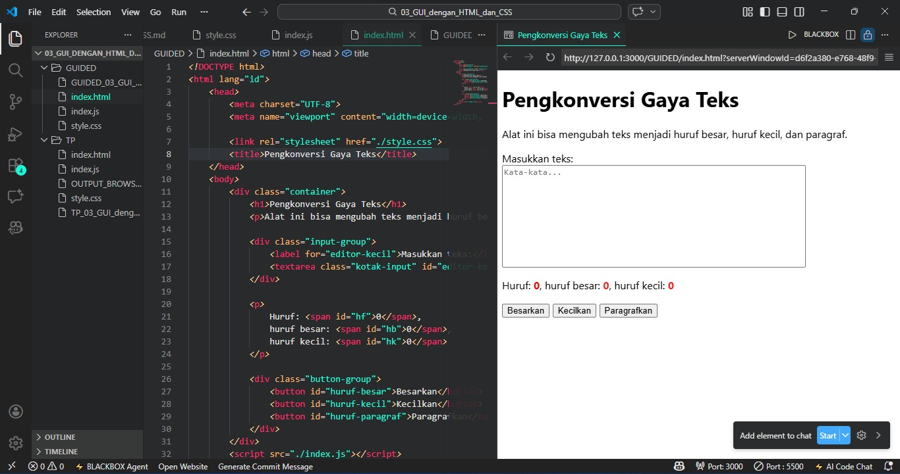

# Guided 03 – GUI dengan HTML dan CSS

---
##  Identitas Mahasiswa

**Nama**    : Radita Putri Nuraini  
**NIM**     : 103122400056  
**Kelas**   : SE-08-02  

**Dosen Pengampu** : Yudha Islami Sulistiya  

**Asisten Praktikum** :  
 1. Adhiansyah Muhammad Pradana Farawowan  
 2. Hamid Khaeruman  

---

##  Soal

Buatlah sebuah tata letak halaman web yang berada di **tengah halaman** seperti contoh yang diberikan. Selain itu, ubah jenis font yang digunakan pada halaman menjadi **Inconsolata** yang diambil dari **Google Fonts**.

---

## Kode Sumber

Program ini terdiri dari beberapa file berikut:

- [`index.html`](./index.html)  
- [`style.css`](./style.css)   
- [`index.js`](./index.js)  

---

##  Output Program

Berikut tampilan halaman ketika dijalankan pada browser:

---

## Deskripsi Program

Program ini merupakan sebuah alat pengkonversi gaya teks yang dirancang menggunakan kombinasi HTML, CSS, dan JavaScript. 

HTML menampilkan UI dengan komponen textarea, tombol eksekusi, serta panel informasi statistik untuk memantau jumlah karakter, huruf kapital, dan huruf kecil secara akurat.

CSS digunakan dengan container yang diposisikan di pusat layar (centered layout) serta penggunaan tipografi Inconsolata untuk tampilan yang konsisten dan keterbacaan teks.

JavaScript digunakan untuk mengubah seluruh teks menjadi huruf besar, mengubah menjadi huruf kecil semua, atau merapikan format paragraf di mana setiap awal kata secara otomatis akan diawali dengan huruf kapital.

