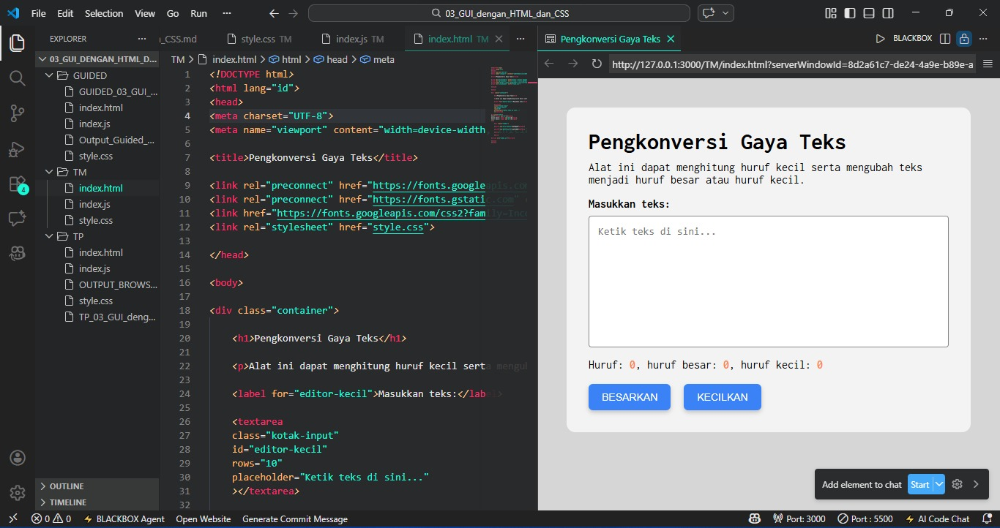

# Tugas Mandiri 03 – GUI dengan HTML dan CSS
---

## Identitas Mahasiswa

**Nama**    : Radita Putri Nuraini 
**NIM**     : 103122400056 
**Kelas**   : SE-08-02  

**Dosen Pengampu** : Yudha Islami Sulistiya 

**Asisten Praktikum** :  
 1. Adhiansyah Muhammad Pradana Farawowan  
 2. Hamid Khaeruman  

---

## Soal

Setelah kamu menyelesaikan tugas pendahuluan, 
terapkanlah fungsi untuk : 
(1) menghitung huruf kecil yang disediakan di #hk, 
(2) mengubah huruf kecil ke huruf besar ketika pengguna menekan tombol #huruf-besar, 
(3) mengubah huruf besar ke huruf kecil ketika pengguna menekan tombol #huruf-kecil.

Untuk nomor 2 dan 3, tampilkan hasilnya di dalam editor-kecil.

Kemudian, hapuslah fitur "Paragrafkan" dari alat.

---

# Kode Sumber

- [`index.html`](./index.html)  
- [`style.css`](./style.css)  
- [`index.js`](./index.js)

---

# Output Program

Berikut tampilan program ketika dijalankan pada browser:

---

# Deskripsi Program

Program "Pengkonversi Gaya Teks" dikembangkan menggunakan perpaduan HTML, CSS, dan JavaScript. Pengguna disediakan sebuah area input teks (textarea) untuk mengetik, dilengkapi dengan panel informasi statistik di bagian bawah, serta dua buah tombol aksi utama, yakni "BESARKAN" dan "KECILKAN".

Seluruh elemen dibungkus dalam sebuah wadah (container) berlatar belakang abu-abu terang yang diposisikan tepat di tengah layar. Menggunakan jenis huruf Inconsolata dari Google Fonts agar teks yang diketik terlihat lebih rapi, konsisten, dan mudah dibaca. Selain itu, tombol-tombol aksinya didesain menonjol dengan warna biru cerah dan diberikan efek visual interaktif berupa bayangan yang akan bereaksi ketika tombol disorot atau diklik oleh pengguna.

Program ini bekerja secara real-time karena logika pemrograman JavaScript yang berjalan di baliknya. Setiap kali pengguna mengetik, program akan langsung menghitung dan menampilkan tiga informasi sekaligus: total karakter keseluruhan, jumlah huruf kapital, serta jumlah huruf kecil. Saat pengguna mengklik tombol "BESARKAN", seluruh teks di dalam kotak akan otomatis dikonversi menjadi huruf kapital semua, begitu pula sebaliknya dengan tombol "KECILKAN" yang akan mengubah teks menjadi huruf kecil semua. Setelah proses konversi gaya teks ini dilakukan, angka pada panel statistik juga akan langsung diperbarui secara otomatis untuk menyesuaikan dengan kondisi teks yang baru.