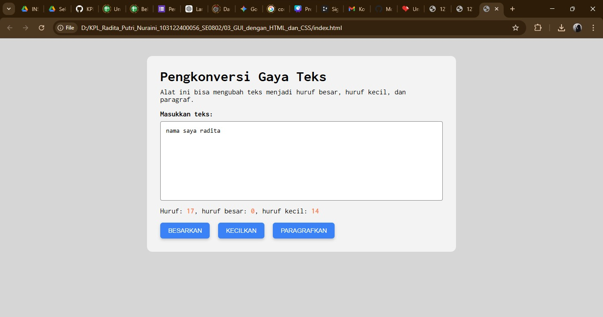

# Tugas Pendahuluan 02: GUI dengan HTML dan CSS

**Nama** : Radita Putri Nuraini 
**NIM** : 103122400056
**Kelas** : SE-08-02 

Asisten Praktikum : 
1. Adhiansyah Muhammad Pradana Farawowan
2. Hamid Khaeruman

Soal

Buatlah tata letak laman sehingga seluruh konten halaman berada di tengah halaman seperti pada contoh yang diberikan. Selain itu, ubah jenis font yang digunakan pada halaman menjadi Inconsolata yang diambil dari Google Fonts.

Kode Sumber

[`index.html`](./index.html) --> struktur utama halaman web  
[`style.css`](./style.css) --> pengaturan tampilan dan tata letak halaman  
[`index.js`](./index.js) -->  script JavaScript yang digunakan pada halaman 

output browser

Deskripsi

Tata letak halaman dapat berada di tengah karena seluruh elemen dibungkus di dalam sebuah container. Pada CSS, container diberi pengaturan max-width untuk membatasi lebar halaman dan margin: auto untuk membuat margin kiri dan kanan otomatis. Ketika margin kiri dan kanan bernilai otomatis, browser akan membagi ruang kosong secara seimbang sehingga container berada di tengah halaman. Akibatnya tampilan yang awalnya berada di pinggir menjadi terpusat dan lebih rapi.