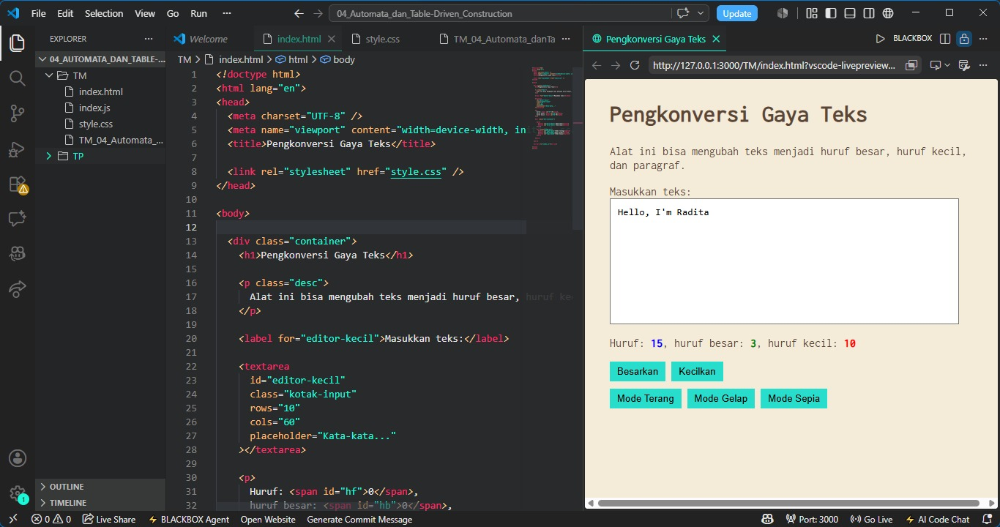

# Tugas Mandiri 04 – Automata dan Table-Driven Construction

---

## Identitas Mahasiswa

**Nama** : Radita Putri Nuraini  
**NIM** : 103122400056  
**Kelas** : SE-08-02

**Asisten Praktikum** :

* Adhiansyah Muhammad Pradana Farawowan
* Hamid Khaeruman

---

## Soal

Tambahkan fitur **mode gelap (dark mode)** pada aplikasi pengkonversi gaya teks.
Ketika pengguna menekan tombol **Mode Gelap**, tampilan aplikasi harus berubah dengan ketentuan berikut:

* Background pada **#editor-kecil** berubah menjadi warna `#2e3443`
* Background pada **tombol** berubah menjadi warna `#29ddcc`
* **Border tombol tidak ditampilkan**
* Warna teks pada tombol **tidak diubah**

Selain itu, tombol **Mode Terang** digunakan untuk mengembalikan tampilan ke kondisi awal.

Pada tugas mandiri, ditambahkan fitur **mode sepia** dengan ketentuan:

* Background halaman: `#F4ECD8`
* Warna teks: `#5B4636`
* Form (textarea) tetap berwarna putih
* Tersedia tiga mode: **Light, Dark, dan Sepia**

---

## Kode Sumber

Program ini dibuat menggunakan beberapa file berikut:

* [`index.html`](./index.html) → berisi struktur utama halaman web
* [`style.css`](./style.css) → berisi pengaturan tampilan dan tema (light, dark, sepia)
* [`index.js`](./index.js) → berisi logika konversi teks dan pengaturan state mode tampilan

---

## Output

---

## Deskripsi Program

Setiap state merepresentasikan mode tampilan yang tersedia, yaitu Mode Terang, Mode Gelap, dan Mode Sepia. Perpindahan antar state terjadi ketika pengguna menekan tombol mode yang sesuai. Mekanisme ini mencerminkan konsep automata, di mana sistem berpindah dari satu state ke state lainnya berdasarkan input yang diberikan pengguna.

Implementasi dilakukan dengan memanfaatkan JavaScript untuk menambahkan atau menghapus class CSS pada elemen root halaman. Setiap class memiliki aturan tampilan yang berbeda sehingga antarmuka dapat berubah sesuai mode yang dipilih.