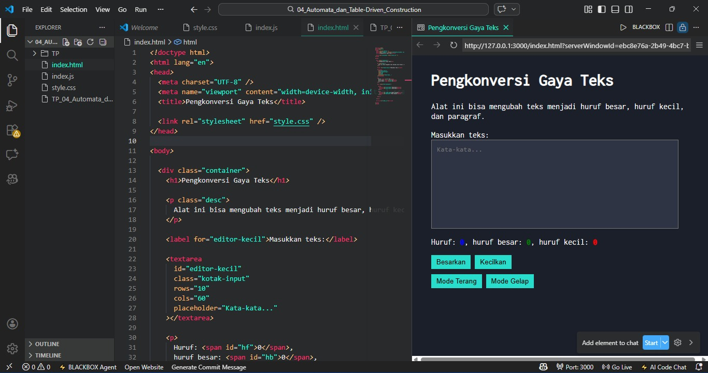

# Tugas Pendahuluan 04 – Automata dan Table-Driven Construction
---

## Identitas Mahasiswa

**Nama**    : Radita Putri Nuraini
**NIM**     : 103122400056
**Kelas**   : SE-08-02

**Asisten Praktikum** :

* Adhiansyah Muhammad Pradana Farawowan
* Hamid Khaeruman

---

## Soal

Tambahkan fitur **mode gelap (dark mode)** pada aplikasi pengkonversi gaya teks.
Ketika pengguna menekan tombol **Mode Gelap**, tampilan aplikasi harus berubah dengan ketentuan berikut:

* Background pada **#editor-kecil** berubah menjadi warna `#2e3443`
* Background pada **tombol** berubah menjadi warna `#29ddcc`
* **Border tombol tidak ditampilkan**
* Warna teks pada tombol **tidak diubah**

Selain itu, tombol **Mode Terang** digunakan untuk mengembalikan tampilan ke kondisi awal.

---

## Kode Sumber

* [`index.html`](./index.html) 
* [`style.css`](./style.css) 
* [`index.js`](./index.js) 

---

## Output

---

## Deskripsi

Program ini berfungsi untuk dapat mengubah format teks dan menganalisis jumlah karakter secara otomatis. Dibuat menggunakan HTML, CSS, dan JavaScript, memungkinkan pengguna mengubah teks menjadi huruf besar atau kecil melalui tombol yang tersedia.

Fiturnya meliputi : 
- Mengubah teks dalam textarea menjadi huruf besar atau kecil secara instan 
- Menghitung total huruf, jumlah huuf besar dan jumlah huruf kecil yaang otomatis diperbarui setiap teks diinputkan
- Implementasi fitur Mode Gelap dan Mode Terang dilakukan dengan manipulasi class CSS (dark-mode) pada elemen body. Saat tombol ditekan, event listener pada JavaScript akan menambah atau menghapus class tersebut untuk mengubah warna latar belakang dan gaya tombol sesuai preferensi pengguna.