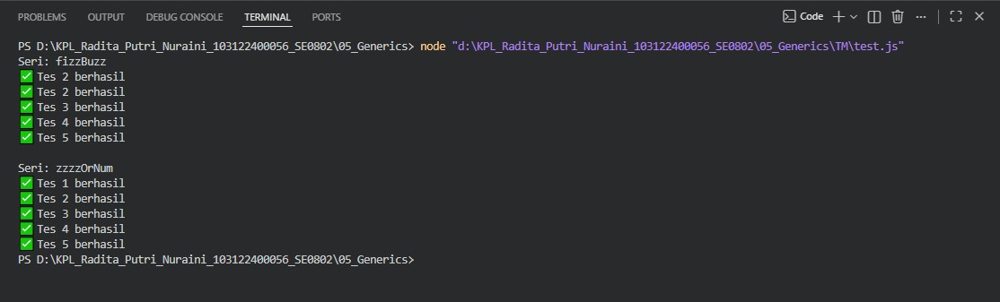

# Tugas Mandiri 05 – Generics

---

## Identitas Mahasiswa

**Nama** : Radita Putri Nuraini  
**NIM** : 103122400056  
**Kelas** : SE-08-02

**Asisten Praktikum** :

* Adhiansyah Muhammad Pradana Farawowan
* Hamid Khaeruman

---

## Soal

Membuat FizzBuzz dengan aturan kali ini adalah:

1.Fungsi fizzBuzz hanya menerima larik yang semua elemennya terdiri dari bilangan bulat dan mengeluarkan larik pula yang bisa jadi bercampur string dan bilangan 2.Fungsi zzzzOrNum hanya menerima sebuah data tunggal berupa bilangan bulat dan mengembalikan "Fizz", "FizzBuzz", "Buzz", atau bilanga bulat sesuai logikanya 3.Kedua fungsi harus ada dan harus disertai JSDoc sesuai tipe data yang disiratkan dari no. 1, no. 2, dan perilaku yang diharapkan di bawah fizzBuzz harus menggunakan fungsi zzzzOrNum di dalamnya

---

## Kode Sumber

Program ini dibuat menggunakan beberapa file berikut:

* [`fizz.js`](./fizz.js) → berisi implementasi fungsi `fizzBuzz` dan `zzzzOrNum`
* [`test.js`](./test.js) → berisi pengujian program menggunakan assert

---

## Output

---

## Deskripsi Program

Program ini mengimplementasikan algoritma **FizzBuzz** dengan dua fungsi utama. Fungsi `zzzzOrNum()` memeriksa sebuah angka dan mengembalikan `"Fizz"`, `"Buzz"`, `"FizzBuzz"`, atau angka itu sendiri sesuai aturan FizzBuzz. Fungsi `fizzBuzz()` digunakan untuk memproses seluruh elemen dalam array menggunakan fungsi tersebut. Program juga dilengkapi dengan **unit test** untuk memastikan hasil yang dihasilkan sesuai dan mampu menangani input yang tidak valid.