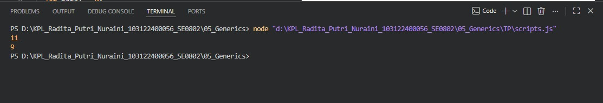

# Tugas Pendahuluan 05 – Generics

---

## Identitas Mahasiswa

**Nama** : Radita Putri Nuraini  
**NIM** : 103122400056  
**Kelas** : SE-08-02  

**Asisten Praktikum** :

* Adhiansyah Muhammad Pradana Farawowan
* Hamid Khaeruman

---

## Soal

Diberikan dua proses perhitungan, yaitu menghitung jumlah seluruh karakter dan menghitung jumlah huruf (tanpa spasi).

Buatlah **satu fungsi generik** yang dapat menangani kedua proses tersebut hanya dengan satu fungsi.

---

## Kode Sumber

Program ini dibuat menggunakan file berikut:

* [`scripts.js`](./scripts.js) → berisi fungsi generik untuk menghitung karakter

---

## Output

---

## Deskripsi Program

Program digunakan untuk menghitung jumlah karakter dalam sebuah string berdasarkan tipe perhitungan yang dipilih. Fungsi `hitung()` menerima dua parameter, yaitu teks (`str`) dan tipe perhitungan (`tipe`). Jika tipe bernilai `"semua"`, program menghitung seluruh karakter termasuk spasi. Jika tipe bernilai `"huruf"`, program hanya menghitung karakter selain spasi. Hasil perhitungan kemudian ditampilkan ke konsol menggunakan `console.log()`.
