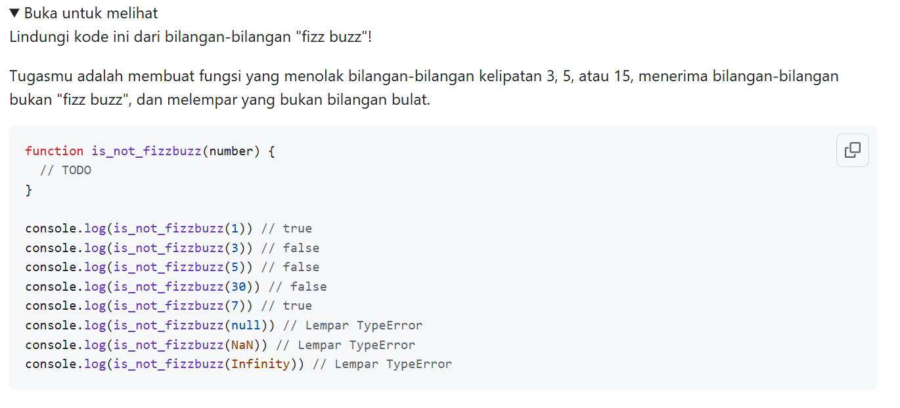
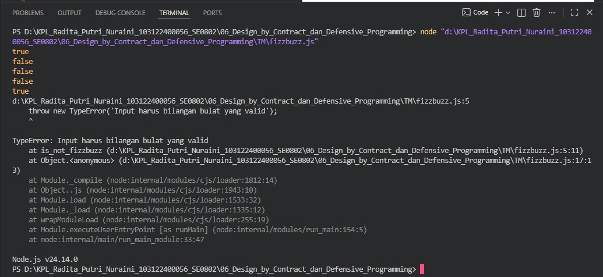

# Tugas Mandiri 06_Design by Contract dan Defensive Programming

---

## Identitas Mahasiswa

**Nama** : Radita Putri Nuraini  
**NIM** : 103122400056  
**Kelas** : SE-08-02

**Asisten Praktikum** :

* Adhiansyah Muhammad Pradana Farawowan
* Hamid Khaeruman

---

## Soal

---

## Kode Sumber

Program ini dibuat menggunakan beberapa file berikut:

* [`fizzbuzz.js`](./fizzbuzz.js) 

---

## Output

---

## Deskripsi Program

Program ini digunakan untuk menentukan apakah suatu bilangan bukan merupakan kelipatan 3 atau 5. Fungsi `is_not_fizzbuzz()` menerima sebuah bilangan bulat sebagai input dan mengembalikan nilai `true` jika bilangan tersebut bukan kelipatan 3 maupun 5, serta `false` jika termasuk salah satu atau keduanya. Program juga menerapkan Defensive Programming dengan melakukan validasi input menggunakan `TypeError` untuk memastikan bahwa nilai yang diberikan merupakan bilangan bulat yang valid. Jika input berupa `null`, `NaN`, `Infinity`, atau tipe data lain yang tidak sesuai, program akan menghasilkan pesan kesalahan untuk mencegah terjadinya perilaku yang tidak diinginkan.