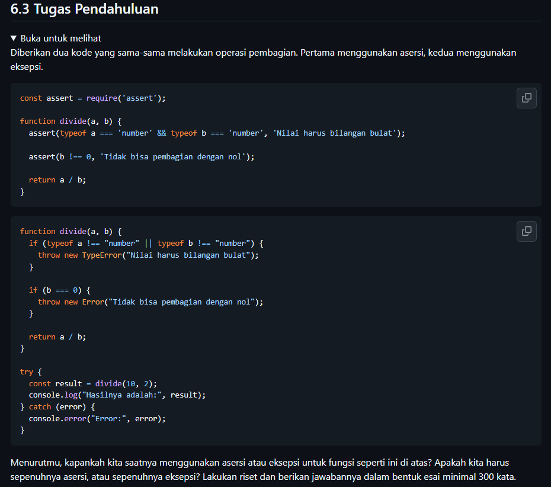

## Jawaban Tugas Pendahuluan modul 06

**Analisis Perbandingan: Asersi vs Eksepsi**

Dalam pengembangan perangkat lunak, asersi (assertion) dan eksepsi (exception) digunakan untuk mendeteksi dan menangani kesalahan, tetapi memiliki tujuan yang berbeda.

Asersi digunakan untuk memvalidasi kondisi yang seharusnya selalu benar berdasarkan asumsi pengembang. Dalam konsep *Design by Contract* (DbC), asersi sering digunakan untuk memeriksa *precondition* dan *invariant*. Pada fungsi `divide(a, b)`, kondisi bahwa `b` tidak boleh bernilai nol dapat dianggap sebagai asumsi internal yang harus dipenuhi. Jika kondisi tersebut gagal, berarti terdapat kesalahan pada logika program.

Sebaliknya, eksepsi digunakan untuk menangani kesalahan yang mungkin terjadi saat program dijalankan, terutama akibat input yang tidak valid. Pada fungsi yang sama, pengguna dapat memasukkan nilai nol atau tipe data selain angka. Dalam kasus ini, penggunaan `TypeError` atau `Error` memungkinkan program menangani kesalahan secara terkontrol melalui mekanisme *try-catch*.

Oleh karena itu, asersi dan eksepsi sebaiknya digunakan secara bersamaan. Asersi membantu menjaga konsistensi logika internal program, sedangkan eksepsi membantu menangani kesalahan dari luar sistem. Kombinasi keduanya akan menghasilkan perangkat lunak yang lebih andal, mudah dipelihara, dan sesuai dengan prinsip *Design by Contract*.
