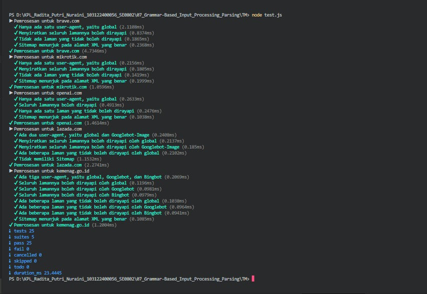

# Tugas Mandiri 07 – Grammar-Based Input Processing

---

## Identitas Mahasiswa

**Nama** : Radita Putri Nuraini  
**NIM** : 103122400056  
**Kelas** : SE-08-02  

**Asisten Praktikum** :

* Adhiansyah Muhammad Pradana Farawowan
* Hamid Khaeruman

---

## Soal

Buatlah sebuah fungsi bernama **`parseRobots`** yang dapat menguraikan isi dari file `robots.txt` menjadi **POJO (Plain Old JavaScript Object)**.

Properti yang harus diuraikan adalah:

* **User-agent** → nama robot perayap
* **Allow** → daftar halaman yang boleh dirayapi
* **Disallow** → daftar halaman yang tidak boleh dirayapi
* **Sitemap** → alamat peta situs (XML)

Struktur folder yang digunakan:

```plaintext
index.js
test.js
structure.d.ts (opsional)
daftar/
```

---

## Kode Sumber

Program ini dibuat menggunakan beberapa file berikut:

* [`index.js`](./index.js) 
* [`test.js`](./test.js) 
* [`daftar/`](./daftar) 

---

## Output




---

## Deskripsi

Program digunakan untuk melakukan **parsing file `robots.txt`** dan mengubah isinya menjadi object JavaScript (POJO) yang terstruktur. Proses parsing dilakukan dengan membaca setiap baris, memisahkan key dan value, serta membersihkan spasi yang tidak diperlukan. Program menerapkan **manajemen state** untuk melacak *User-agent* yang sedang aktif sehingga aturan `Allow` dan `Disallow` dapat dikelompokkan dengan benar. Selain itu, program mampu menangani berbagai kondisi seperti komentar, baris kosong, beberapa *User-agent*, nilai `Disallow` yang kosong, serta lebih dari satu `Sitemap`. Hasil parsing kemudian disimpan dalam bentuk object yang memudahkan pengolahan dan pengujian lebih lanjut.
