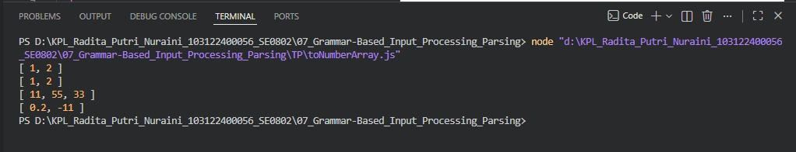

# Tugas Pendahuluan 07 – Grammar-Based Input Processing

---

## Identitas Mahasiswa

**Nama** : Radita Putri Nuraini  
**NIM** : 103122400056  
**Kelas** : SE-08-02

**Asisten Praktikum** :

* Adhiansyah Muhammad Pradana Farawowan
* Hamid Khaeruman

---

## Soal

Buatlah fungsi bernama **`toNumberArray`** yang mengubah deretan angka bertipe string menjadi **larik angka**.

Contoh:

```javascript id="a1k2l3"
console.log(toNumberArray("1, 2")) // [1, 2]
console.log(toNumberArray(["1", "2"])) // [1, 2]
console.log(toNumberArray(" 11,55,33   ")) // [11, 55, 33]
console.log(toNumberArray(["0.2", "-11", "abc23"])) // [0.2, -11]
```

---

## Kode Sumber

Program dibuat dalam satu file utama:

* [`index.js`](./index.js) → berisi fungsi `toNumberArray`

---

## Output



---

## Deskripsi

Fungsi `toNumberArray` digunakan untuk mengonversi input berupa string atau array menjadi array yang berisi nilai numerik atau angka.

Proses yang dilakukan:

* Jika input berupa string → data dipisahkan menggunakan `split(",")`
* Jika input berupa array → setiap elemen diproses secara langsung
* Menghapus spasi yang tidak diperlukan dengan `trim()`
* Mengubah setiap elemen menjadi tipe data angka menggunakan `Number()`
* Menyaring nilai yang tidak valid menggunakan `isNaN()`

Fungsi juga mendukung:

* Angka desimal
* Angka negatif
* Input dalam bentuk string maupun array
* Mengabaikan elemen yang bukan angka sehingga hasil akhir hanya berisi nilai numerik yang valid.