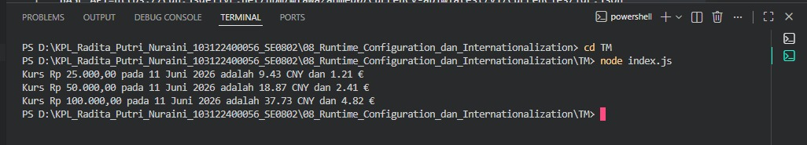

# Tugas Mandiri 08 – Runtime Configuration dan Internationalization

---

## Identitas Mahasiswa

**Nama** : Radita Putri Nuraini  
**NIM** : 103122400056  
**Kelas** : SE-08-02  

**Asisten Praktikum** :

- Adhiansyah Muhammad Pradana Farawowan  
- Hamid Khaeruman  

---

## Soal

Buat program yang menampilkan kurs rupiah (IDR) terhadap mata uang asing:

- Yuan Tiongkok (CNY)
- Euro (EUR)

Dengan ketentuan:

- Menggunakan API untuk mengambil data kurs
- URL API disimpan di dalam file `.env`
- Menggunakan `Intl` untuk:
  - Format mata uang
  - Format tanggal
- Menghilangkan pesan promosi dari `dotenv`
- Menampilkan output seperti berikut:

plaintext
Kurs Rp25.000,00 pada 23 April 2026 adalah 9.93 CNY dan 1.24 €

Uji program dengan:

Rp25.000
Rp50.000
Rp100.000

---
## Kode Sumber

Program dibuat dalam beberapa bagian:

* [`index.js`](./index.js)  
* [`.env`](./.env)  

---
## Output

----
## Deskripsi Program

Program ini digunakan untuk melakukan konversi mata uang dari Rupiah (IDR) ke Yuan Tiongkok (CNY) dan Euro (EUR) berdasarkan kurs terkini yang diambil secara otomatis dari API. Program memanfaatkan library Axios untuk mengambil data kurs dari internet dan Dotenv untuk membaca konfigurasi URL API yang disimpan pada file .env.

Setelah memperoleh data kurs, program akan menghitung nilai konversi sejumlah uang dalam Rupiah ke mata uang CNY dan EUR. Hasil konversi kemudian ditampilkan ke layar dengan format mata uang dan tanggal yang telah disesuaikan menggunakan fitur Internationalization API (Intl.NumberFormat dan Intl.DateTimeFormat) sehingga lebih mudah dibaca oleh pengguna Indonesia.