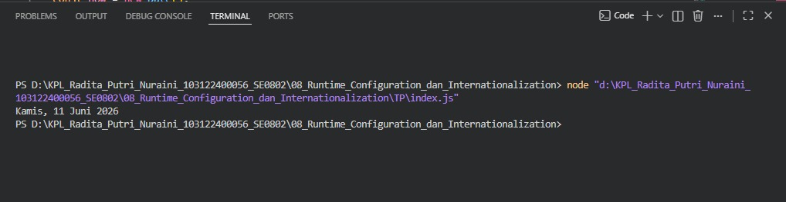

# Tugas Pendahuluan 08 – Runtime Configuration dan Internationalization

---

## Identitas Mahasiswa

**Nama** : Radita Putri Nuraini  
**NIM** : 103122400056  
**Kelas** : SE-08-02

**Asisten Praktikum** :

* Adhiansyah Muhammad Pradana Farawowan
* Hamid Khaeruman

---

## Soal

Tampilkan tanggal sekarang dengan format:

```plaintext id="0pq9f3"
Sabtu, 18 April 2026
```

Ketentuan:

* Format harus mengikuti bahasa Indonesia
* Tidak boleh menggunakan string manual
* Wajib menggunakan `Intl.DateTimeFormat`

---

## Kode Sumber

Program dibuat dalam satu file utama:

* [`index.js`](./index.js) 

---

## Output



---

## Deskripsi Program

Program digunakan untuk menampilkan tanggal saat ini dalam format lokal Indonesia. Objek `Date` digunakan untuk mengambil tanggal dan waktu saat ini, kemudian `Intl.DateTimeFormat` digunakan untuk memformat tanggal agar menampilkan nama hari, tanggal, bulan, dan tahun dalam bahasa Indonesia. Hasil format tanggal tersebut kemudian ditampilkan ke konsol menggunakan `console.log()`.