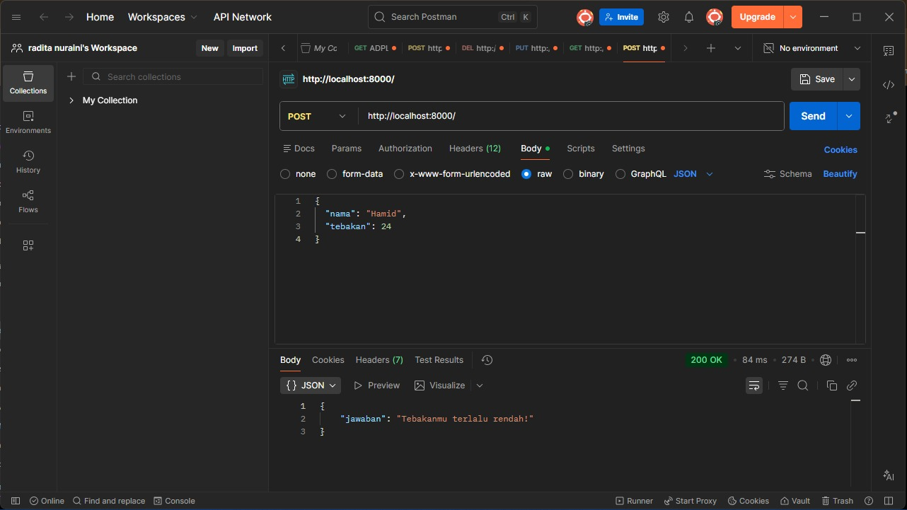
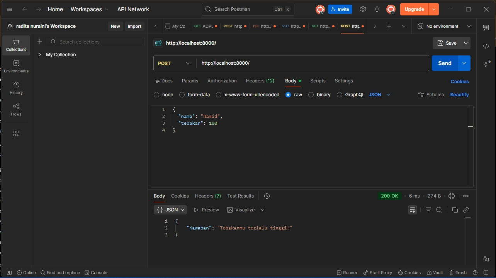
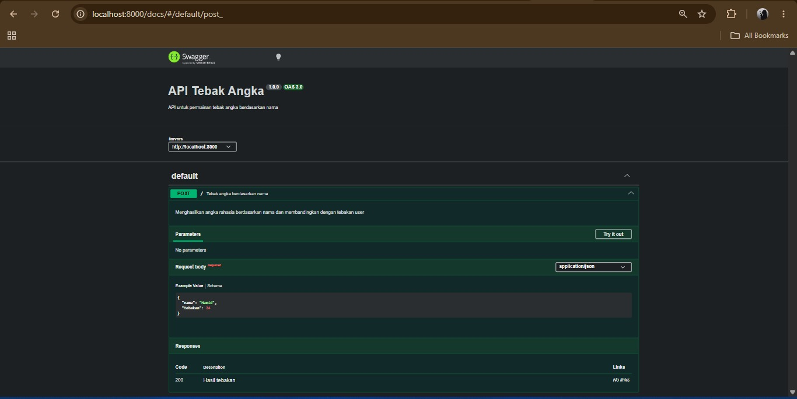

# Tugas Mandiri 09 – API Tebak Angka

---

## Identitas Mahasiswa

**Nama** : Radita Putri Nuraini  
**NIM** : 103122400056  
**Kelas** : SE-08-02  

**Asisten Praktikum** :

- Adhiansyah Muhammad Pradana Farawowan  
- Hamid Khaeruman  

---

## Soal

Membuat sebuah API sederhana dengan ketentuan sebagai berikut:

1. Hanya memiliki satu endpoint yaitu **POST /**
2. Menerima input berupa JSON:

{
  "nama": "Hamid",
  "tebakan": 24
}

3. Menghasilkan output:
   - Jika benar → "Benar sekali! Tebakannya adalah X."
   - Jika terlalu tinggi → "Tebakanmu terlalu tinggi!"
   - Jika terlalu rendah → "Tebakanmu terlalu rendah!"

4. Angka harus selalu sama untuk nama yang sama  
5. Rentang angka 1–100  
6. Bersifat case-sensitive  
7. Tidak menggunakan library random  

---

## Kode Sumber

- app.js  
- swagger.js  

---

## Output

---

## Deskripsi Program

Program ini merupakan sebuah REST API permainan tebak angka yang dikembangkan menggunakan Node.js dan Express.js. API menerima input berupa nama pengguna dan angka tebakan dalam format JSON melalui metode HTTP POST. Sistem kemudian menghasilkan sebuah angka rahasia berdasarkan nama yang diberikan menggunakan metode hashing sederhana, sehingga setiap nama akan selalu menghasilkan angka yang sama dalam rentang 1–100.

Setelah angka rahasia terbentuk, program membandingkan nilai tebakan pengguna dengan angka tersebut dan memberikan respons berupa salah satu dari tiga kemungkinan hasil, yaitu "Tebakanmu terlalu rendah!", "Tebakanmu terlalu tinggi!", atau "Benar sekali!" apabila tebakan sesuai dengan angka yang dihasilkan. Selain itu, program juga melakukan validasi input untuk memastikan data yang dikirimkan lengkap dan sesuai format yang ditentukan.

Untuk memudahkan pengujian dan dokumentasi API, program telah terintegrasi dengan Swagger UI sehingga spesifikasi endpoint, format request, dan response dapat diakses melalui browser secara interaktif. Dengan adanya dokumentasi ini, pengguna dapat memahami dan mencoba API tanpa perlu melihat langsung kode sumber program.