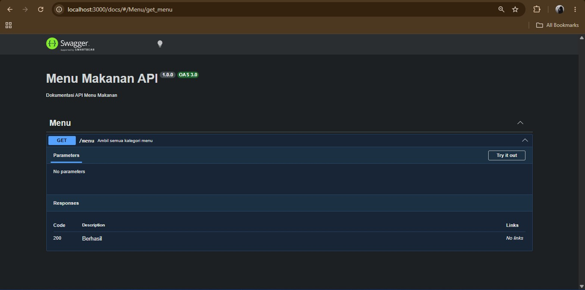
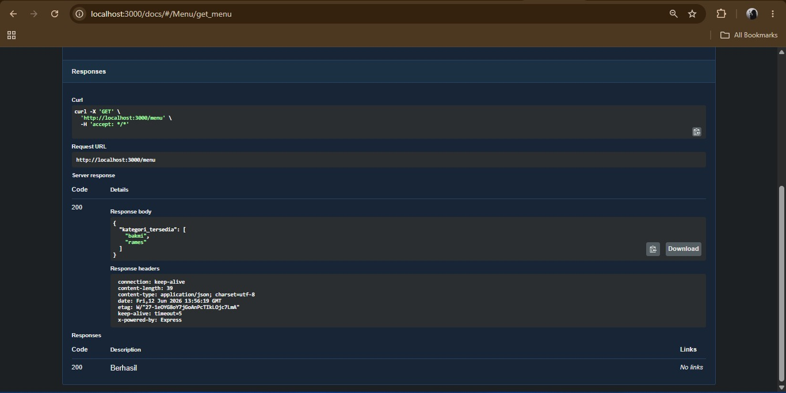

# Tugas Pendahuluan 09 – OpenAPI dan Endpoint API

---

## Identitas Mahasiswa

**Nama** : Radita Putri Nuraini  
**NIM** : 103122400056  
**Kelas** : SE-08-02  

**Asisten Praktikum** :

- Adhiansyah Muhammad Pradana Farawowan  
- Hamid Khaeruman  

---

## Soal

Buatlah satu endpoint API beserta dokumentasi OpenAPI-nya:

- Endpoint: **GET /menu**
- Fungsi: menampilkan daftar semua nama kategori menu yang ada

---

## Kode Sumber
- [`index.js`](./index.js)  
- [`swagger.js`](./swagger.js) 

---

## Output

---
## Deskripsi Program

Program ini dibuat untuk menyediakan layanan API sederhana yang menampilkan informasi kategori menu makanan. API dikembangkan menggunakan framework Express.js pada platform Node.js, sehingga dapat diakses melalui web menggunakan metode HTTP.

Data menu yang digunakan pada program disimpan dalam bentuk objek JavaScript dan terdiri dari beberapa kategori, seperti bakmi dan nasi rames. Program menyediakan endpoint GET /menu yang berfungsi untuk menampilkan seluruh kategori menu yang tersedia dalam format JSON.

Selain itu, program juga menerapkan Swagger sebagai alat dokumentasi API. Dengan adanya Swagger, pengguna dapat melihat informasi mengenai endpoint yang tersedia, fungsi masing-masing endpoint, serta melakukan pengujian API secara langsung melalui browser tanpa memerlukan aplikasi tambahan seperti Postman.

Dokumentasi API dapat diakses melalui halaman /docs, sehingga memudahkan pengembang maupun pengguna dalam memahami cara kerja layanan yang telah dibuat. Integrasi Swagger juga membantu memastikan dokumentasi selalu sesuai dengan implementasi program yang sedang berjalan.