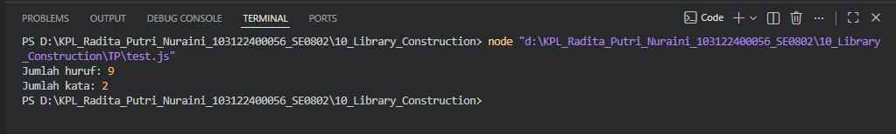

# Tugas Pendahuluan 10 – Library Construction

---

## Identitas Mahasiswa

**Nama** : Radita Putri Nuraini
**NIM** : 103122400056  
**Kelas** : SE-08-02  

**Asisten Praktikum** :
- Adhiansyah Muhammad Pradana Farawowan  
- Hamid Khaeruman  

---

## Soal

Buatlah sebuah **pustaka (library) JavaScript** yang menyediakan utilitas berupa dua fungsi:

- Fungsi untuk menghitung **jumlah huruf**
- Fungsi untuk menghitung **jumlah kata**

Dengan ketentuan sebagai berikut:

- Hanya karakter alfabet **A–Z (huruf besar dan kecil)** yang dihitung  
- **Spasi tidak dihitung** sebagai huruf  
- Pustaka harus dapat **diimpor (import)** ke dalam file lain  

---

## Kode Sumber

- `index.js`   
- `test.js` 
- `package.json`   

---

## Output

---

## Deskripsi Program

Pada tugas ini dibuat sebuah pustaka JavaScript sederhana yang dapat digunakan untuk menghitung jumlah huruf dan jumlah kata dalam sebuah teks. Pustaka ini memiliki dua fungsi utama, yaitu hitungHuruf() untuk menghitung banyaknya huruf dan hitungKata() untuk menghitung jumlah kata yang terdapat pada teks yang diberikan.

Dalam proses perhitungannya, fungsi hitungHuruf() hanya menghitung karakter alfabet sehingga angka, tanda baca, spasi, maupun simbol lainnya tidak ikut dihitung. Sementara itu, fungsi hitungKata() digunakan untuk mengenali dan menghitung setiap kata yang terdiri dari rangkaian huruf.

Pustaka ini dikembangkan menggunakan konsep ES Module (ESM) dengan memanfaatkan sintaks export dan import, sehingga fungsi yang telah dibuat dapat digunakan kembali pada file atau program lain dengan lebih mudah. Untuk memastikan program berjalan sesuai harapan, dilakukan pengujian melalui file test.js yang mengimpor fungsi dari index.js dan menampilkan hasil perhitungan ke terminal. Dengan demikian, pengguna dapat melihat secara langsung jumlah huruf dan jumlah kata dari teks yang diuji.