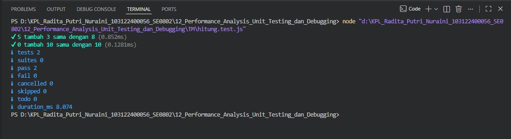

# Tugas Mandiri 12 – Performance Analysis, Unit Testing, dan Debugging

---

## Identitas Mahasiswa

**Nama** : Radita Putri Nuraini  
**NIM** : 1031224000456  
**Kelas** : SE-08-02  

**Asisten Praktikum** :

- Adhiansyah Muhammad Pradana Farawowan  
- Hamid Khaeruman  

---

## Soal

Buatlah unit test menggunakan framework **Jest** untuk menguji fungsi perhitungan harga pada file `hitung.js`.

Contoh fungsi:

```javascript
function hitungHarga(totalBelanja, diskon) {
    return totalBelanja - diskon;
}
```

Kemudian buat beberapa skenario pengujian menggunakan `test()`, `expect()`, dan `toBe()` sesuai materi Unit Testing pada modul.

---

## Kode Sumber

- `hitung.js` 
- `hitung.test.js`   
- `package.json`  

---

## Implementasi Program

### `hitung.js`

```javascript
export function tambahPengitung(terkini, jumlah) {
  terkini = terkini + jumlah;
  return terkini;
};
```

### `hitung.test.js`

```javascript
import { test } from 'node:test';
import assert from 'node:assert';
import { tambahPengitung } from './hitung.js';

test('5 tambah 3 sama dengan 8', () => {
  assert.strictEqual(tambahPengitung(5, 3), 8);
});

test('0 tambah 10 sama dengan 10', () => {
  assert.strictEqual(tambahPengitung(0, 10), 10);
});
```

### `package.json`

```json
{
  "name": "tm",
  "version": "1.0.0",
  "description": "",
  "main": "hitung.js",
  "scripts": {
    "test": "node --test"
  },
  "keywords": [],
  "author": "",
  "license": "ISC",
  "type": "module"
}
```
---

## Output



---

## Deskripsi Program

Program ini dibuat untuk melakukan operasi penjumlahan sederhana menggunakan fungsi `tambahPengitung()`. Untuk memastikan fungsi bekerja dengan benar, dilakukan pengujian otomatis menggunakan **Node.js Test Runner** dengan beberapa skenario penjumlahan. Pengujian dijalankan melalui perintah `npm test` untuk memverifikasi bahwa hasil yang dihasilkan sesuai dengan yang diharapkan.
