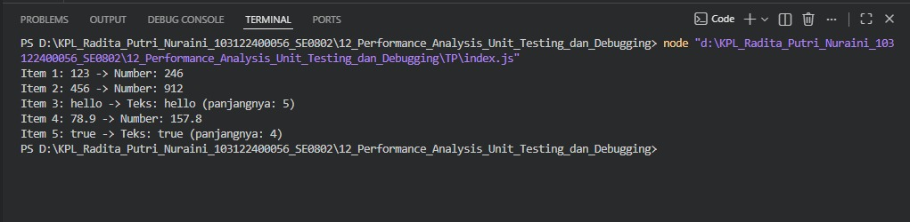

# Tugas Pendahuluan 12 – Performance Analysis, Unit Testing, dan Debugging

---

## Identitas Mahasiswa

**Nama** : Radita Putri Nuraini  
**NIM** : 103122400056  
**Kelas** : SE-08-02  

**Asisten Praktikum** :
- Adhiansyah Muhammad Pradana Farawowan  
- Hamid Khaeruman  

---

## Soal

Cobalah untuk menangkap kecacatan (bug) pada kode berikut:

```javascript
function main() {
  const data = [
    "123",
    456,
    "hello",
    78.9,
    true,
  ];

  for (let i = 0; i < data.length; i++) {
    const result = processData(data[i]);
    console.log(`Item ${i + 1}: ${data[i]} -> ${result}`);
  }
}

function processData(data) {
  const str = data.toLowerCase();
  const num = parseInt(str);

  if (!isNaN(num) && str === String(num)) {
    return `Number: ${num * 2}`;
  }

  return `Teks: ${str} (panjangnya: ${str.length})`;
}

main();
```

---

## Kode Sumber

- `index.js`  
- `README.md`  

---

## Output



---

## Analisis Bug

Kecacatan utama pada program terletak pada fungsi processData(), yaitu penggunaan method toLowerCase() secara langsung pada parameter data tanpa memastikan bahwa data tersebut bertipe string. Padahal, array data berisi berbagai tipe data seperti string, number, dan boolean. Akibatnya, ketika fungsi menerima nilai numerik seperti 456 atau 78.9, program akan mencoba menjalankan method toLowerCase() pada tipe data yang tidak mendukung method tersebut sehingga menghasilkan error TypeError dan menyebabkan program berhenti sebelum seluruh data berhasil diproses.

Selain itu, penggunaan parseInt() juga berpotensi menimbulkan masalah karena hanya mengambil bagian bilangan bulat dan mengabaikan angka di belakang koma. Sebagai contoh, nilai 78.9 akan diubah menjadi 78, sehingga hasil pengolahan data menjadi kurang akurat. Program juga menggunakan validasi yang terlalu ketat dengan membandingkan string asli dengan hasil konversi angka, yang dapat menyebabkan beberapa data numerik dalam bentuk string tidak dikenali dengan benar. Oleh karena itu, diperlukan penanganan tipe data yang lebih baik, misalnya dengan mengubah seluruh input menjadi string terlebih dahulu dan menggunakan metode konversi angka yang lebih sesuai.

## Solusi

Untuk mengatasi kecacatan pada program, fungsi processData() perlu diperbaiki agar dapat menangani berbagai tipe data dengan aman. Salah satu caranya adalah mengubah seluruh input menjadi string terlebih dahulu menggunakan String(data) sebelum memanggil method toLowerCase(). Dengan demikian, program tidak akan menghasilkan error ketika menerima nilai bertipe number atau boolean. Selain itu, penggunaan parseInt() dapat diganti dengan Number() agar bilangan desimal tetap diproses secara utuh dan tidak kehilangan nilai di belakang koma. Perbaikan ini membuat fungsi lebih fleksibel dalam menangani berbagai jenis input dan mencegah program berhenti akibat kesalahan tipe data.

---

## Kode Setelah Perbaikan

```javascript
function main() {
  const data = [
    "123",
    456,
    "hello",
    78.9,
    true,
  ];

  for (let i = 0; i < data.length; i++) {
    const result = processData(data[i]);
    console.log(`Item ${i + 1}: ${data[i]} -> ${result}`);
  }
}

function processData(data) {
  // Mengubah semua input menjadi string terlebih dahulu
  const str = String(data).toLowerCase();

  // Mengonversi string menjadi angka
  const num = Number(str);

  // Jika berhasil dikonversi menjadi angka
  if (!isNaN(num)) {
    return `Number: ${num * 2}`;
  }

  // Jika bukan angka, dianggap teks
  return `Teks: ${str} (panjangnya: ${str.length})`;
}

main();
```

---

## Kesimpulan

Ditemukan bahwa program mengalami bug karena fungsi toLowerCase() dipanggil pada data yang tidak selalu bertipe string. Perbaikan dilakukan dengan mengonversi seluruh input menjadi string terlebih dahulu dan menggunakan Number() untuk memproses data numerik. Setelah diperbaiki, program dapat berjalan dengan baik, mampu menangani berbagai tipe data, serta menghasilkan output yang lebih akurat tanpa menimbulkan error.