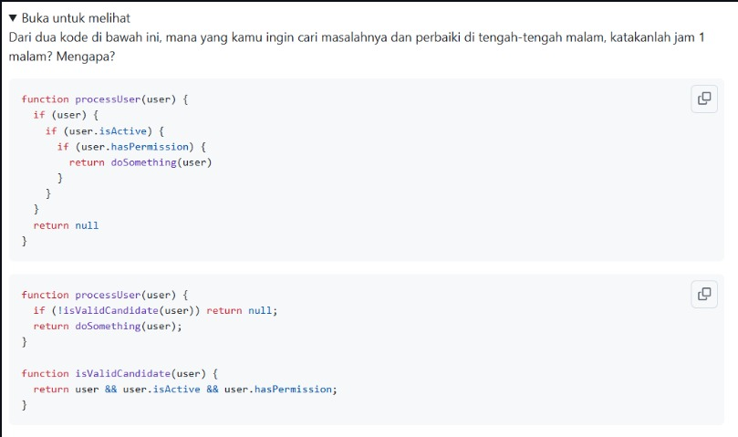

# Tugas Mandiri 14 – Clean Code

## Identitas Mahasiswa

**Nama** : Radita Putri Nuraini  
**NIM** : 103122400056  
**Kelas** : SE-08-02  

---

## Soal


## Jawab 
Saya akan memilih kode kedua untuk dicari masalahnya dan diperbaiki pada jam 1 malam.
``` javascript
function processUser(user) {
    if (!isValidCandidate(user)) return null;
    return doSomething(user);
}

function isValidCandidate(user) {
    return user && user.isActive && user.hasPermission;
}
```

## Kesimpulan
Pada situasi nyata, terutama ketika harus melakukan debugging di tengah malam, saya akan jauh lebih memilih kode kedua karena:

- Lebih mudah dibaca.
- Logika bisnis tersimpan dalam fungsi yang memiliki nama jelas.
- Lebih cepat menemukan sumber bug.
- Lebih mudah dikembangkan dan diuji.
- Mengurangi kompleksitas akibat nested if.

Prinsip Clean Code yang diterapkan pada kode kedua adalah meaningful function names, single responsibility, dan menghindari nested conditional melalui guard clause, sehingga kode menjadi lebih mudah dipahami dan dipelihara.